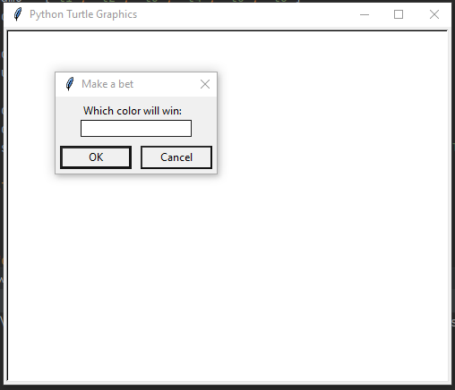
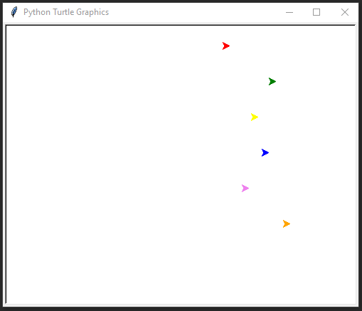
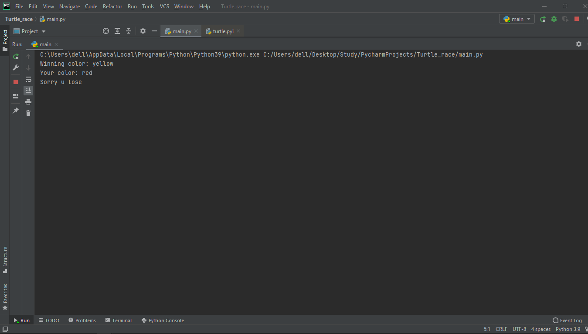

# Turtle-Race-Bet
It is a simple game were you bet on certain color turtle before the race and see which color turtle wins the race. In this game a pop-up window pops and ask for our color of the turtle that we are beting on and after entering, the pop-up window disappears and the race gets started. After completion of the game it tells us the winning color of the turtle
and tells whether we have won or lose the game. It is simple and fun game using python.

## Technology
- Python
- Tkinter
- Turtle
- Screen

## Preview

**This is the preview of game**

**This is the preview of result**
